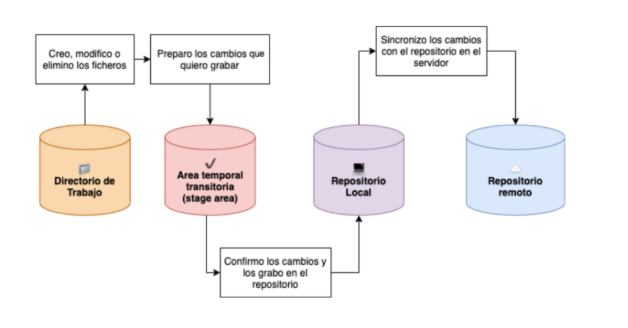

# GitSCESI_apuntes
Apuntes del curso de git impartido a los estudiantes que estan postulando a la SCESI

# 1. Introduccion
El núcleo de Git son los repositorios, que son carpetas donde se guardan versiones del proyecto y el historial de cambios.
Estos repositorios pueden ser, Locales (Que se guardan en nuestra pc) o Remotos (Guardados en la nube)

Cuando se crean nuevas ramas , los cambios pueden unirse a otras ramas mediante un proceso llamado merge.
Una vez combinados, esos cambios se pueden enviar al servidor remoto usando push (empujar cambios al repositorio remoto).
Para traer cambios desde el servidor remoto al equipo local, se usa pull.

## Configuracion
```bash
$ git config --global user.name "<tu nombre>"
$ git config --global user.email "<tu email>" 
```

## Comprobar configuracion
```bash
$ git config --list
user.name=midudev  
user.email=miduga@gmail.com  
pull.rebase=false  
core.repositoryformatversion=0  
core.filemode=true  
core.bare=false  
core.logallrefupdates=true  
core.ignorecase=true  
pull.rebase=true
```

## Inicializar un proyecto
Para inicializar un proyecto debemos irnos al directorio donde queremos que este, y usar el siguiente comando:
```bash
$ git init
```

# 2. States y Commits
Al usar Git nuestros archivos pueden estar en alguno de los siguientes estados:
- **Modified**: El archivo contiene cambios pero todavía no han sido marcados para ser confirmados. Se encuentra en el directorio de trabajo.
- **Staged**: Los cambios estan listos para ser guardados en el repositorio local.
- **Commited**: Los cambios han sido guardados con exito en el repositorio local a esta accion se llama commit. 


