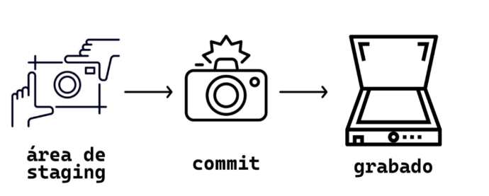

# GitSCESI_apuntes
Apuntes del curso de git impartido a los estudiantes que estan postulando a la SCESI

# 1. Introduccion
El núcleo de Git son los repositorios, que son carpetas donde se guardan versiones del proyecto y el historial de cambios.
Estos repositorios pueden ser, Locales (Que se guardan en nuestra pc) o Remotos (Guardados en la nube)

Cuando se crean nuevas ramas , los cambios pueden unirse a otras ramas mediante un proceso llamado merge.
Una vez combinados, esos cambios se pueden enviar al servidor remoto usando push (empujar cambios al repositorio remoto).
Para traer cambios desde el servidor remoto al equipo local, se usa pull.

## Configuracion
```bash
$ git config --global user.name "<tu nombre>"
$ git config --global user.email "<tu email>" 
```

## Comprobar configuracion
```bash
$ git config --list
user.name=midudev  
user.email=miduga@gmail.com  
pull.rebase=false  
core.repositoryformatversion=0  
core.filemode=true  
core.bare=false  
core.logallrefupdates=true  
core.ignorecase=true  
pull.rebase=true
```

## Inicializar un proyecto
Para inicializar un proyecto debemos irnos al directorio donde queremos que este, y usar el siguiente comando:
```bash
$ git init
```

# 2. States y Commits
Al usar Git nuestros archivos pueden estar en alguno de los siguientes estados:
- **Modified**: El archivo contiene cambios pero todavía no han sido marcados para ser confirmados. Se encuentra en el directorio de trabajo.
- **Staged**: Los cambios estan listos para ser guardados en el repositorio local.
- **Commited**: Los cambios han sido guardados con exito en el repositorio local a esta accion se llama commit. 

<p align="center">
  
</p>

## Como deshacer un archivo modificado
Los siguientes comandos los podemos usar en el caso de que querramos volver a la ultima version de un archivo que
estabamos modificando, ten en cuenta que usando estos comandos perderas tu trabajo realizado en estos archivos.
```bash
# restaurar el archivo index.html
$ git restore index.html

# restaurar todo el directorio de trabajo
$ git restore .

# restaurar todos los archivos terminados en *.js
$ git restore '*.js'

```
## Añadir archivos al area de staging
```bash
# añade todos los cambios realizados
$ git add .

# añade los cambios realizados en un determinado archivo
$ git add index.html

# En caso de que ya no quieras añadir ese archivo y lo quieras quitar
$ git reset index.html

```
## ¿Que es un Commit?
<p align="center">
  
</p>

Los commits sirven para guardar los cambios en el repositorio, es una de las piezas mas importantes para entender git.

```bash
# Para realizar un commit
$ git commit -m "cambios realizados en el archivo index"

```

## ¿Que es el HEAD?
El HEAD es el punto actual en del historial de cambios en el repositorio (En otras palabras es el punto en el que estamos actualmente).


# 3. Ramas, Merge y Conflictos
<p align="center">
  
</p>

## Ramas en Git
Las ramas permiten trabajar en distintas versiones del código de forma aislada.
Por defecto, todo proyecto comienza en la rama main o master.

### Para crear una nueva rama:

```bash
git branch nombre-rama
```
### Para cambiar de rama:

```bash
git checkout nombre-rama
```
Las ramas se usan para desarrollar nuevas funcionalidades sin necesidad de afectar el codigo actual

## Merge de ramas
El comando git merge se usa para unir los cambios de una rama en otra, normalmente desde una rama secundaria hacia main o dev.

```bash
git checkout main
git merge nombre-rama
```

## Conflictos de merge (Merge Conflicts)
Un conflicto ocurre cuando dos ramas modifican la misma parte del mismo archivo y Git no puede decidir cuál mantener.

Git marcará las zonas en conflicto así:

```plaintext
Copiar
Editar
<<<<<<< HEAD
tu código
=======
código de la otra rama
>>>>>>> nombre-rama
```
### Para resolver un conflicto:
- Abre el archivo en conflicto.

- Elige qué código mantener o combina ambos.

- Guarda los cambios.

- Marca como resuelto:

```bash
git add archivo
git commit
```
## Eliminar ramas
``` bash
$ git branch --delete rama_objetivo
```

Esto es realizado con fines de organizacion, pero mucho cuidado ya que se perdera todo el trabajo
realizado en ella si no esta mergeada.


