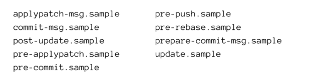

# GitSCESI_apuntes
Apuntes del curso de git impartido a los estudiantes que estan postulando a la SCESI

# 1. Introduccion
El núcleo de Git son los repositorios, que son carpetas donde se guardan versiones del proyecto y el historial de cambios.
Estos repositorios pueden ser, Locales (Que se guardan en nuestra pc) o Remotos (Guardados en la nube)

Cuando se crean nuevas ramas , los cambios pueden unirse a otras ramas mediante un proceso llamado merge.
Una vez combinados, esos cambios se pueden enviar al servidor remoto usando push (empujar cambios al repositorio remoto).
Para traer cambios desde el servidor remoto al equipo local, se usa pull.

## Configuracion
```bash
$ git config --global user.name "<tu nombre>"
$ git config --global user.email "<tu email>" 
```

## Comprobar configuracion
```bash
$ git config --list
user.name=midudev  
user.email=miduga@gmail.com  
pull.rebase=false  
core.repositoryformatversion=0  
core.filemode=true  
core.bare=false  
core.logallrefupdates=true  
core.ignorecase=true  
pull.rebase=true
```

## Inicializar un proyecto
Para inicializar un proyecto debemos irnos al directorio donde queremos que este, y usar el siguiente comando:
```bash
$ git init
```

# 2. States y Commits
Al usar Git nuestros archivos pueden estar en alguno de los siguientes estados:
- **Modified**: El archivo contiene cambios pero todavía no han sido marcados para ser confirmados. Se encuentra en el directorio de trabajo.
- **Staged**: Los cambios estan listos para ser guardados en el repositorio local.
- **Commited**: Los cambios han sido guardados con exito en el repositorio local a esta accion se llama commit. 

<p align="center">
  
</p>

## Como deshacer un archivo modificado
Los siguientes comandos los podemos usar en el caso de que querramos volver a la ultima version de un archivo que
estabamos modificando, ten en cuenta que usando estos comandos perderas tu trabajo realizado en estos archivos.
```bash
# restaurar el archivo index.html
$ git restore index.html

# restaurar todo el directorio de trabajo
$ git restore .

# restaurar todos los archivos terminados en *.js
$ git restore '*.js'

```
## Añadir archivos al area de staging
```bash
# añade todos los cambios realizados
$ git add .

# añade los cambios realizados en un determinado archivo
$ git add index.html

# En caso de que ya no quieras añadir ese archivo y lo quieras quitar
$ git reset index.html

```
## ¿Que es un Commit?
<p align="center">
  
</p>

Los commits sirven para guardar los cambios en el repositorio, es una de las piezas mas importantes para entender git.

```bash
# Para realizar un commit
$ git commit -m "cambios realizados en el archivo index"

```

## ¿Que es el HEAD?
El HEAD es el punto actual en del historial de cambios en el repositorio (En otras palabras es el punto en el que estamos actualmente).


# 3. Ramas, Merge y Conflictos
<p align="center">
  
</p>

## Ramas en Git
Las ramas permiten trabajar en distintas versiones del código de forma aislada.
Por defecto, todo proyecto comienza en la rama main o master.

### Para crear una nueva rama:

```bash
git branch nombre-rama
```
### Para cambiar de rama:

```bash
git checkout nombre-rama
```
Las ramas se usan para desarrollar nuevas funcionalidades sin necesidad de afectar el codigo actual

## Merge de ramas
El comando git merge se usa para unir los cambios de una rama en otra, normalmente desde una rama secundaria hacia main o dev.

```bash
git checkout main
git merge nombre-rama
```

## Conflictos de merge (Merge Conflicts)
Un conflicto ocurre cuando dos ramas modifican la misma parte del mismo archivo y Git no puede decidir cuál mantener.

Git marcará las zonas en conflicto así:

```plaintext
<<<<<<< HEAD
tu código
=======
código de la otra rama
>>>>>>> nombre-rama
```
### Para resolver un conflicto:
- Abre el archivo en conflicto.

- Elige qué código mantener o combina ambos.

- Guarda los cambios.

- Marca como resuelto:

```bash
git add archivo
git commit
```
## Eliminar ramas
``` bash
$ git branch --delete rama_objetivo
```

Esto es realizado con fines de organizacion, pero mucho cuidado ya que se perdera todo el trabajo
realizado en ella si no esta mergeada.

# 4. GitHub
GitHub es un repositorio remoto alojado en la nube basado en el sistema de control de versiones Git, ofrece
diversas funcionalidades al usuario con un una interfaz amigable.

## ¿Que es un repositorio remoto?
Los repositorios remotos son repositorios que están hospedados en un servidor
y que servirá de punto de sincronización entre diferentes repositorios locales.

## Clonar un repositorio remoto
``` bash
$ git clone https://github.com/Drunok/GitSCESI_apuntes.git

```

## Enlazar un repositorio local a uno remoto
Para conectar nuestro repositorio local a uno remoto debemos aplicar el siguiente comando:
``` bash
$ git remote add <alias> <direccion> 
```
Como alias podemos usar cualquier nombre que querramos.

## Para escribir en el repositorio remoto
Mandamos los cambios a la rama main del repositorio remoto con el alias origin.
``` bash
$ git push origin main
```
En caso de no poder realizarse esta accion significa que el repositorio local no tiene cambios que han ocurrido en el 
repositorio remoto.

En el caso de crear una rama remota se procede a la creacion de una rama normal en nuestro repo remoto y luego se realiza
la accion de push respectiva.

## 5. Pull Request
Una pull request es una solicitud para que los cambios hechos en una rama de un repositorio (generalmente en una copia o fork) se revisen y, si están correctos, se integren a la rama principal del proyecto.

## Como hacer una buena Pull Request
1. Buscar el archivo CONTRIBUTING.MD o seguir el estilo del repositorio
2. Respetar el estilo del repositorio
3. Enfoca tu codigo en una sola cosa
4. Explica tu Pull Request

## Revisar una Pull Request
Es importante saber valorar el tiempo de la otra persona y es importante saber como dar un feedback positivo y productivo.

# 6. Git Flow
## Ramas Principales

<p align="center">
  
</p>

- **Main o Master**: Contiene codigo  de produccion.
- **Dev o Develop**: Codigo pre-produccion con caracteristicas que aun tienen que ser probadas.

## Ramas de Apoyo

<p align="center">
  
</p>

- **Feature**:  Cuando se trabaja en una nueva caracteristica para el proyecto.
- **Release**: Cuando se prepara el lanzamiento de una nueva version
- **Hotfix**: Cambios imprevistos o parches de ultimo momento.

## GitHub Flow
<p align="center">
  
</p>
Es una estrategia diseñada por el equipo de GitHub que no es tan burocratica como lo es su predecesora Git Flow, ya que se basa en la creacion de ramas las cuales mediante PR seran integradas a la rama principal.
Cabe recalcar que se puede elaborar un proceso de revision automatizado para verificar que el codigo cumpla con los estandares de la organizacion.

## Trunk Based Development
<p align="center">
  
</p>

Trunk Based Development (TBD) es una estrategia de desarrollo en la que todos los desarrolladores trabajan sobre una única rama principal (como main o trunk) y realizan integraciones frecuentes, idealmente a diario.

### Ventajas principales:
- **Menos conflictos**: al integrar constantemente, se evitan grandes diferencias entre ramas.
- **Entrega continua**: facilita la automatización y el despliegue continuo.
- **Código más limpio y probado**: promueve pruebas automatizadas y revisiones constantes.
- **Mayor colaboración**: el equipo trabaja sobre una base común y actualizada.

## 🧭 Estrategias de flujo en Git – Conclusiones clave
No adoptes una estrategia sin antes analizar tu contexto: no existen métodos universales ni inalterables.

La estrategia elegida debe enfocarse en:
✅ Entrega continua de valor
✅ Buena experiencia de desarrollo
✅ Alta calidad del software

## 🚀 Recomendación ideal:
Aspirar a trabajar directamente en la rama principal (main), con commits frecuentes y evitando ramas auxiliares prolongadas.

## ⚠️ Para lograrlo se necesita:
- Alta disciplina, seniority y responsabilidad.
- Un sistema CI/CD sólido, rápido y confiable.
- Excelente trabajo en equipo.

## 🛠 Buenas prácticas:
- Limita la duración de las ramas a 2 o 3 días como máximo.
- Mejora tu CI/CD: mide cobertura de tests, velocidad de despliegue, cuellos de botella y puntos de bloqueo.
- Permite commits directos a main en entornos bien gestionados y colaborativos.

# 7. Buenas Practicas en Git
Es recomendable hacer commits pequeños y seguidos agrupando las pequeñas mejoras que vas haciendolas

## Cómo escribir buenos commits
- Usa verbo en imperativo: Add, Fix, Change, Remove.
- No uses punto final ni puntos suspensivos.
- Máximo 50 caracteres en el título del commit.
- Agrega contexto en el cuerpo si es necesario (después de una línea en blanco).
- Usa prefijos semánticos para claridad:
  * feat: nueva funcionalidad
  * fix: corrección de errores
  * docs: documentación
  * refactor: mejora del código
  * style:, test:, ci:, etc.

Puedes usar herramientas como husky para validar código antes de hacer commit.

## Escribir buenos nombres de ramas
1. Se consistente al nombrar tus ramas
2. Usa el nombre de la accion que realiza la rama: 
  - bug
  - feature
  - experiment
  - hotfix
3. Usa los IDs de Jira o del sistema de tickets que uses.

**OJO solo es recomendable modificar el historial de un repositorio si es que se publico las contraseñas o alguna credencial sensible del proyecto.**

# 8. Como deshacer mis cambios
- Si se quiere mantener los cambios 
``` bash
$ git reset --soft HEAD-1
```
- Si no se quiere mantener los cambios
``` bash
$ git reset --hard HEAD-1
```

# 9. Hooks, Alias y Trucos
Un hook, o punto de enganche, es la posibilidad de ejecutar una acción o script cada vez que ocurre un evento
determinado de Git.
Estos se colocan dentro de la carpeta .git/hooks con el nombre del evento que escuchara.

<p align="center">
  
</p>

## Hooks del lado del cliente (local)
Los hooks locales son scripts que se ejecutan en tu repositorio local y no se comparten automáticamente con otros repositorios. Esto permite tener configuraciones distintas en cada copia local.

## Hooks comunes:
- pre-commit: Ideal para ejecutar linters o verificar que no se estén comiteando demasiados cambios.
- prepare-commit-msg: Permite modificar el mensaje del commit antes de que el usuario lo edite.
- commit-msg: Verifica el formato del mensaje del commit. Útil con herramientas como commitlint.
- post-commit: Se puede usar para enviar notificaciones (ej. a Slack).
- pre-push: Ejecuta tests antes de subir cambios al repositorio remoto.
- post-checkout y post-merge: Útiles para limpiar archivos temporales o eliminar ramas obsoletas.

## Hooks del lado del servidor (remoto)
Los hooks del servidor se ejecutan en el repositorio remoto (como GitHub, GitLab o tu propio servidor).
Aunque no se usan comúnmente por los desarrolladores, son clave en sistemas grandes o automatizados.

## Hooks comunes del servidor:
- *** pre-receive ***: Verifica los commits antes de aceptarlos. Se puede usar para:

  * Validar formato de commits.
  * Comprobar permisos del usuario.
  * Bloquear conflictos o rebase no permitidos.

- *** update ***: Similar a pre-receive, pero más granular. Permite controlar qué ramas o referencias pueden actualizarse.

- *** post-receive ***: Se usa después de recibir cambios.
Ejemplos:
  * Enviar notificaciones por email.
  * Actualizar una interfaz o dashboard con nuevos commits o ramas.

## Como puedo crear mi propio Hook
Para crear un propio hook sólo tienes que crear un archivo nombre-del-hook en la carpeta .git/hooks y en él poner el
código que quieras que se ejecute. Puedes usar todo tipo de intérpretes de lenguaje de programación como bash, node,
python, perl, etc.

